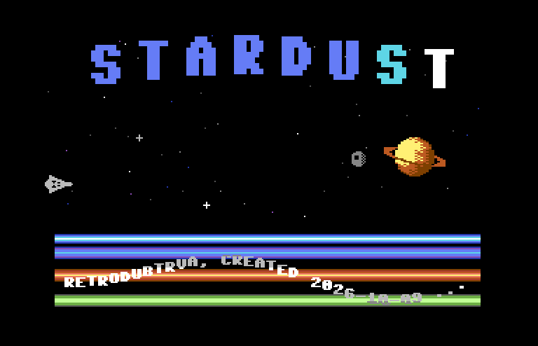
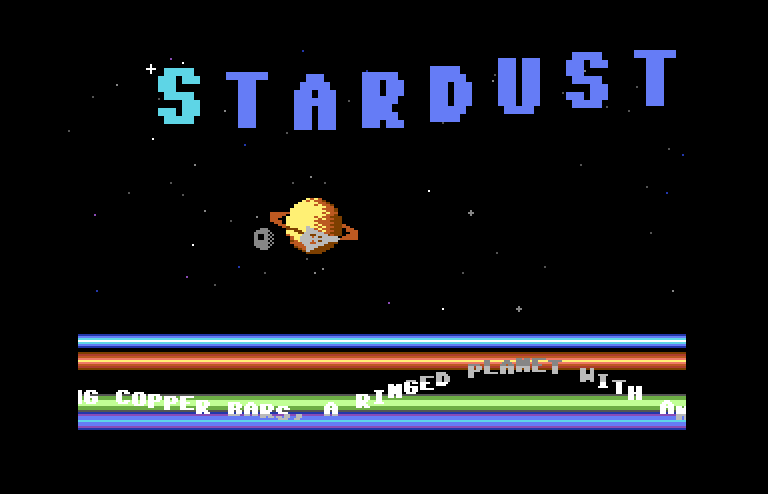

# STARDUST

A Commodore 64 space scroller in 6502 assembly by **RetroDubTRVA**. It has a sprite
logo, a ringed planet with a moon orbiting in front of it and behind it, a ship with a
flickering thruster and a parallax starfield. Along the bottom, a DYCP scroller rides
over copper bars, all to *Nightshift* by Agemixer. It opens with a raster wipe: black,
down to solid blue, a pause, then back up to black.

| | |
|---|---|
|  |  |
| The start-up raster wipe | Credits in the DYCP scroller |
|  | |
| Logo, planet and moon, DYCP scroller over copper bars | |

Screenshots from VICE x64sc, NTSC.

Written for **KickAssembler v5.25**, targeted at **NTSC** C64s first and PAL second.

## Build and run

From this directory:

```bash
java -jar /Applications/KickAssembler/KickAss.jar scroller.asm -odir bin
x64sc -ntsc -autostart bin/scroller.prg
```

RUN/STOP resets to BASIC. Design notes, the memory map and the NTSC cycle budget are in
[`CLAUDE.md`](CLAUDE.md).
