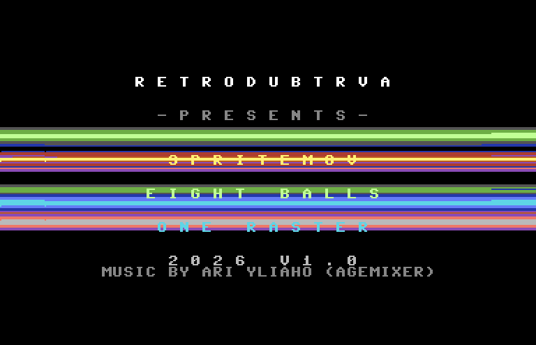
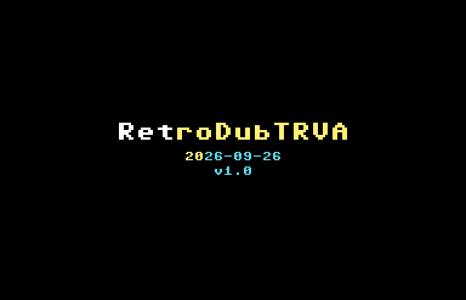
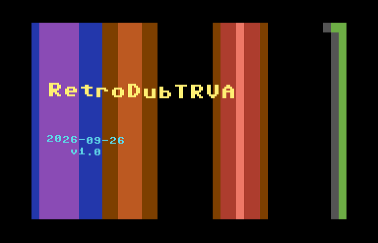
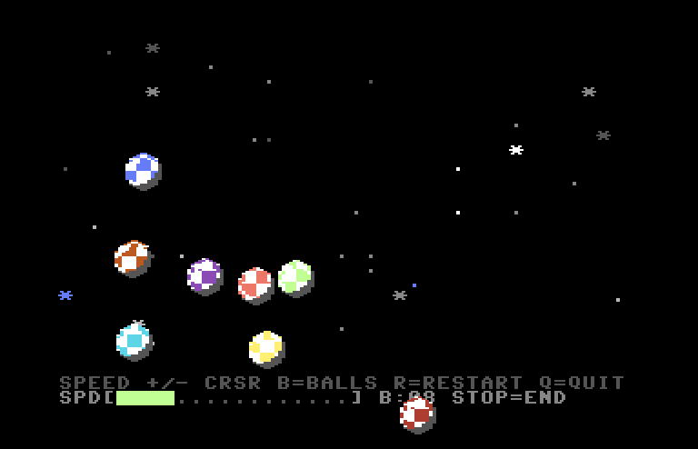

# spritemove

A Commodore 64 demo in 6502 assembly: a raster bar overture, a title card on
black followed by vertical raster bars with the title floating over them, then
4 to 16 rolling checkered "Boing" balls (8 to start) flying around a
starfield with real elastic collisions, collision sparks and SID ping effects, using
the full height of the screen — the vertical border is held open, so the balls
fly into it. Past eight balls the VIC's eight sprites are multiplexed by a
raster IRQ.

Written for **KickAssembler v5.25**, targeted at **NTSC** C64s (US machines)
first and PAL second, tested in **VICE x64sc** on both, deployed via an
**Ultimate II+** cartridge.

| | |
|---|---|
|  |  |
| The raster bar overture | The title card on black |
|  |  |
| Vertical bars behind the floating title | Eight rolling balls in the open border |

Screenshots from VICE x64sc, NTSC.

---

## Build and run

```bash
# Build. Four lines are expected: three from music.asm's .print (the tune's
# name and its load/init/play addresses) and "Writing prg file: main.prg".
java -jar /Applications/KickAssembler/KickAss.jar main.asm -odir bin

# Run (NTSC; drop -ntsc or pass -pal for the PAL check)
/Applications/vice-arm64-gtk3/bin/x64sc -ntsc -autostart bin/main.prg
```

Output is `bin/main.prg`, about 27 KB (`$0801-$714f`). The repo's `/build` and
`/run` slash commands do both steps.

To *see* a particular moment without watching in real time, let VICE run a fixed
number of cycles in warp and screenshot on the way out:

```bash
/Applications/vice-arm64-gtk3/bin/x64sc -ntsc -autostart bin/main.prg \
    -warp -limitcycles 12000000 -exitscreenshot /tmp/shot.png
```

Autostart costs roughly 3.2M cycles before the intro's first frame (measured;
it grows with the `.prg`). NTSC runs 1022727 cycles a second (a frame is 17095),
PAL 985248 (a frame is 19656). The overture and the intro are timed in
**tune ticks**, not frames, so they take the same wall-clock time on both: the
balls appear about 27 seconds in.

### NTSC and PAL

`detect_video` reads the highest raster line at start-up (`$106` NTSC, `$137`
PAL) and three things follow from it:

- **Music tempo.** *Nightshift* is a PAL tune, one play call per 50 Hz frame.
  Played once per 60 Hz NTSC frame it runs 20% fast, so `music_tick` skips
  every sixth call on NTSC: 50 plays a second on both.
- **Intro timing.** The phase lengths are frame counts written to land on the
  tune's beats. On a frame `music_tick` skipped, every duration counter holds
  (`BeatDec`), so the phases stay on the beat; the animation still moves on
  every frame.
- **The overture's band.** Its polled raster bars leave the vertical blank for
  everything else — music, bar movement, rebuilding the line buffer. PAL has
  118 lines of it, NTSC only 69 (about 4500 cycles), so on NTSC the band ends at
  line 232 instead of 250 (the lowest label is at lines 219-226).

Note that `-limitcycles` stops the emulator wherever it lands, which is usually
part way down a frame — the screenshot is then the part of that frame drawn so
far, with the rest black. To get whole frames, find one cycle count that lands
in the vertical blank and step from it in multiples of 17095 (NTSC) or 19656
(PAL).

---

## Controls

| Key | Action |
|---|---|
| `+` / `-` or `CRSR` | Speed level, 1-16 (default 4 = half base speed) |
| `B` / `SHIFT+B` | Ball count, 4-16 (default 8) — see Sprite multiplexing below |
| `R` | Restart from the very top of the intro |
| `Q` or `RUN/STOP` | End the demo, back to a `READY.` prompt |

The bottom **two** text rows are the menu — a fixed legend of the keys on row 23,
and the speed bar, the ball count and the exit key on row 24:

```
SPEED +/- CRSR B=BALLS R=RESTART Q=QUIT
SPD[####............] B:08 STOP=END
```

`R` works during the intro as well as during the demo, because it is scanned in
`check_exit`, which both the intro loop and the main loop call every frame. It
silences the SID, hides the sprites, waits for the key to come back up (otherwise
holding it would restart on every frame and freeze on the intro's first black
frame) and jumps to `start`. `start` resets the stack pointer for exactly this
reason — the jump comes from several `jsr`s deep, so without it every restart
would strand a return address and the stack would eventually wrap into zero page.

`Q` and `RUN/STOP` share keyboard row `$7f` — bits 6 and 7 — so one matrix read
tests both. A joystick in control port 1 is wired onto the same column lines, so
while one is pushed the other keys are ignored (otherwise joystick-down reads as
`R`); the exit keys use bits the joystick never drives and always work.

`RUN/STOP` does not return to BASIC — the demo has overwritten BASIC's zero
page, so there is nothing sane to return to. It silences the SID, clears the
sprites and jumps through the KERNAL reset vector at `$fffc`, which gives a
normal `READY.` prompt. `RUN/STOP+RESTORE` is defused at startup by pointing
the NMI vector `$0318` at an `rti` (`nmi_ignore`): `sei` does not mask NMI,
RESTORE reaches `/NMI` directly, and the kernal's handler would warm-start BASIC
on the same trashed zero page. Masking CIA 2 at `$dd0d` alone cannot stop it.

---

## What it does

### The overture (~10 seconds)

The demo opens with a raster bar sequence in plain text mode:
eight colour bars flying over a black screen while the handle, five labels
and a closing music credit fade up one at a time; the labels go dark with the
closing flash rather than snapping off after it. See `intro_raster.asm`.

There is no per-cell work in it at all. Everything is one byte per **raster
line** in a page-aligned buffer at `$0900`, and a frame is two halves that
never overlap: `rb_show` walks lines 56 to 250 waiting for each one and writing
its byte to both `$d020` and `$d021` (in text mode `$d021` is the paper the
characters sit on, so one write stripes the border and the screen together and
the bars pass *behind* the letters), and everything else — music, keyboard, the
bar movement, the rebuild of the buffer — happens in the ~117 lines between 250
and 56, about 7300 cycles.

A bar is four bytes of state:

```
y = ctr + asr(sin(ph + off) - 128, sh + gsh)
```

`ph` advances by `spd` every frame, `off` is the bar's fixed place in the set,
`sh` is amplitude as a shift (1 is ±64 lines), and `gsh` is a **global** extra
shift added to every bar's own — raising it collapses the whole set into one
line and lowering it blows it back open, which is the entire implode/explode
effect for one byte. The subtract of `$80` and the arithmetic shift right
(`cmp #$80 / ror`, carry = sign) are what keep the swing centred on `ctr`
however far `gsh` squeezes it; a plain `lsr` would drag every bar towards the
top of the screen as the amplitude came down.

A movement mode is just 40 bytes — `off`, `spd`, `sh`, `ctr` and a palette pick
for each of the eight bars — so the behaviour is entirely in the numbers:

| Mode | What it looks like |
|---|---|
| WAVE | One speed, phases an eighth of a turn apart: a single wave travelling down the screen and back |
| SCISSOR | Pairs half a turn apart, staggered — four crossings closing on themselves |
| FAN | One phase, amplitudes 64/32/16/8 mirrored: the bars nest inside one another and breathe |
| CHAOS | Eight speeds (1,2,3,5,7,4,6,9) about eight centres — no two bars ever repeat the same relationship |
| IMPLODE | One speed, `gsh` driven 0→7 or 7→0: the bars converge into one thick bar or erupt out of it |

The script runs nine steps of them, opening on an explosion out of a single
line and closing on the implosion back into one, so the overture is bracketed
by the same move played both ways. The last step before the close is a quiet
beat of its own for a "MUSIC BY ARI YLIAHO (AGEMIXER)" credit — the one label
that is *not* letter-spaced like the other six, and capped to a flat grey, so
it reads as smaller and quieter without an actual second font: there is no
sub-8px text in C64 character mode without a full custom charset (`$d018`
selects one charset for the whole screen, so every glyph the other labels use
would have to be duplicated into it just for one credit line). It ends on a
white strobe that the labels vanish into, and hands over to the intro on a
black screen.

**On raster stability.** The wait loop is `cpy $d012 / bne`, seven cycles, and a
PAL line is 63 — exactly nine iterations, so it detects every line at the same
cycle offset and the bar edges line up down the screen. A badline upsets that:
it halts the CPU for 40 cycles, 40 does not divide by 7, and the loop comes out
on a new phase. So the colour byte is loaded **before** the wait, leaving
nothing between detection and the stores; `$d020` has the new colour by cycle
8-14, which is inside the horizontal blank for six of the seven offsets. The
seventh clips the visible left border and leaves a sliver of the previous
line's colour — 8.5% of lit lines, measured over ten consecutive PAL frames in
VICE, against a solid eight-line staircase when the load sat after the wait.
Closing the last of it needs a cycle-exact loop, which needs a stable entry and
per-badline padding, at which point the loop has no slack and the first frame
whose off-screen work runs long desynchronises it for good. The polling loop is
self-healing by construction, which is worth more here.

### The intro (~15 seconds)

After the overture the title comes up on its own, then vertical raster bars
sweep behind it while it floats. Everything stays in text mode on the demo's
own screen (VIC bank 0); there is no bitmap. See `intro.asm`.

Lengths are in tune ticks (= PAL frames; on NTSC a tick is 6/5 of a frame).

| Phase | Ticks | What happens |
|---|---|---|
| Z | 30 (~0.6s) | Black — a breath after the overture |
| T | 180 (~3.6s) | The title card: name, date and `v1.0` fade up out of black and hold, with nothing behind them |
| F | 2 x 200 (~8s) | The vertical bars fade in and sweep sideways; the labels lift off and float to random spots |
| R | 160 (~3.2s) | The labels glide back to their home and settle exactly; the bars keep sweeping |
| O | 48 (~1s) | Bars and labels fade to black together, and the balls take over from a black screen |

**The labels are sprites.** Name, date and version are built at assembly time
from glyph rows lifted from the C64 character ROM (`intro_text.asm`) and packed
into the eight sprites by `intro_sprites.asm`, at `$0c00` in bank 0 (VIC blocks
`$30-$37`):

- sprites 0-3 — the name, 3 characters each, font rows stored twice and
  X-expanded, so a character is 16x16;
- sprites 4-7 — the date on rows 0-7 and `v1.0` on rows 12-19 of the same
  sprites, both centred in the 12 character slots, 8x8 a character. The date
  and version move together as one label.

None of the font reaches the `.prg`; by run time the letters are already pixels.

**Smooth random movement.** The two labels are two bodies, each a **damped
spring** on X and Y in 8.8 fixed point (`spring`):

    accel = (target - pos) / 512      vel = vel + accel - vel / 16      pos = pos + vel

That is a damping ratio of about 0.7: a label accelerates, glides, and eases
into its target with a few percent of overshoot, and a target that changes
mid-glide just bends the path — it never jumps. `wander` re-picks each body's
target at random every 110-173 frames, from an 8-bit LFSR seeded from the CIA
timer and the raster, so every run floats differently. The two bodies run on
their own timers so they never move in step. Each has its own box — the name in
the top half, the date in the bottom — so they never cross. A small ripple runs
along each word on top, eased in and out so it never snaps.

On the way home (`R`) the springs aim at the home position and `homing` snaps
an axis onto it once it is within -2..+1 px and nearly still. The window is
asymmetric on purpose: the pull rounds toward minus infinity, so -2 and -1 are
rest points too, and a -1..+1 window could leave a label parked 2 px off.

**Vertical bars in text mode.** The overture's bars are one colour per raster
*line*; these are one colour per *column*, and a column is something text mode
already has. The screen is filled with the solid block (screen code `$a0`), so
every cell shows nothing but its colour RAM nibble. `bars_build` draws five
shaded, sine-driven bars (7 columns each, dark edge to mid-bright core) into a
40-byte `col_buf`, and the copy routines spread it down all 25 rows. A bar's
left column is a signed byte, so one unsigned `cpx #40` clips both edges.

The bar colours stop at mid brightness (light blue, light red, green, purple,
orange) and the labels use the four brightest colours (white, yellow, cyan,
light green), because a hi-res sprite has one colour and no outline:
brightness is all that keeps the letters readable over the bars.

**Racing the beam.** Colour RAM is at a fixed address, so it cannot be double
buffered. Instead the frame is ordered so each write lands before the beam
draws it:

| Step | Needed by | Measured, NTSC |
|---|---|---|
| sync at line 250, sprite registers (below every label) | — | — |
| `copy_rows0` — rows 0-5 | line 51 | done by 34 |
| `copy_rows6` — rows 6-12 | line 99 | done by 63 |
| `music_tick`, `check_exit` | — | — |
| `copy_rows13` — rows 13-24 | line 155 | done by 145 |
| `wander`, fades, `bars_build` (next frame) | line 250 | done by 201 |

Each copy is column by column, so its *top* row is the last one finished.
Rows 0-12 as one block measured done at line 56 on NTSC — five lines after row 0
starts drawing — which is why the top is split in two. No frame runs late on
either standard; PAL has 49 more lines of vertical blank and more slack
everywhere.

**Fades, not cuts.** `bk_lvl` (bars) and `spr_lvl` (labels) step 0..7 toward a
goal every `fade_rate` frames, and every colour goes through `fade_tab`, which
maps (level, colour) to a darker shade of the *same* hue by luminance — orange
fades through brown to black rather than snapping. A phase only sets the goals.

The music is *Nightshift* by Ari Yliaho (Agemixer), imported from PSID and
driven from a fixed raster line by `music_tick`: every frame on PAL, five frames
in six on NTSC.

### The demo

Multicolor sprites — checkered "Boing" balls, ray-shaded at assembly time —
fly around a black starfield like billiard balls on a frictionless table, 4 to
16 of them at once (`B` / `SHIFT+B`, default 8).

#### Rolling: 128 frames

`sprite_gen.asm` renders 128 frames into `$2000-$3fff`, all of VIC bank 0 above
the character ROM shadow. The light stays fixed at the top left and the checker
turns underneath it. The frames are a grid of 8 horizontal by 16 vertical roll
phases. Each ball keeps two roll accumulators that add the distance it moved on
each axis, and the frame shown is `$80 | Yphase << 3 | Xphase`. One phase step
is 2 px of travel in X and 1 px in Y, which is one sprite pixel on each axis,
since a multicolor pixel is two wide. One period of the checker (90°) is exactly
the 16 px a 10.2 px-radius ball travels while turning 90°. So the ball rolls
without slipping in any direction, at any speed. To make room, the code moved
up to `$4000`.

#### Physics: elastic collisions

Ball to ball contact is a real 2D collision between equal masses. `|dx|` and
`|dy|` index a 20 × 20 table (`physics_tables.asm`, built at assembly time) that
gives a true circle test, the unit normal `n` and a push-apart distance. If the
two balls are closing along `n`, they exchange the parts of their velocities
along it:

    dot = (vA - vB) · n      vA -= dot·n      vB += dot·n

A head-on hit stops the striker dead and sends the other ball off (Newton's
cradle). A glancing hit deflects both a little. The four 16×8 multiplies use
quarter-square tables (`mul8`, ~45 cycles each). Walls are elastic too, and
they only reflect a ball that is moving into them. With no friction, energy
is only passed around, never lost, so the balls never run down. The normals
are quantised so that `|n|²` stays as close to 1 as 7-bit rounding allows,
because a normal that is always slightly short would drain energy on every
hit. A pile-up resolves at most `MAX_HITS` (3) exchanges per frame and leaves
the rest for two frames later.

Balls no longer swap colours on contact. With a real momentum exchange, a
head-on pair swaps velocities, and swapping colours as well would make them look
as if they passed straight through each other.

#### Sprite multiplexing: more balls than the VIC has sprites

The VIC-II has exactly 8 hardware sprites, fixed in silicon — there is no
ninth one to enable. Above 8 active balls, a **raster IRQ chain** (`mux_irq`)
reuses those 8 sprites part way down the frame: once a sprite has finished
drawing one ball, it is reprogrammed for another ball further down.

Every frame the main loop steps the physics, **sorts the balls by Y**
(`sort_balls`, an insertion sort — cheap, because the order barely changes
frame to frame), resolves collisions, and then `build_list` turns that one
snapshot into a **write list** for the IRQ:

- entries 0-7 are **band 0**: the eight highest balls on sprites 0-7;
- ball *i* (for *i* ≥ 8) re-uses sprite *i* & 7 — the sprite of the ball
  eight places above it — from the first raster line after that ball has
  been drawn (its Y + 21 lines + 2). If that line is not at least 3 lines
  above ball *i*'s own Y, there is no time to switch the sprite, and the
  ball is left out of that frame (it still moves and collides). Measured at
  16 balls over 600 frames: no skips.

The IRQ chain then runs every frame:

- **line 16** — the top IRQ: `$d011` back to 25 rows, swap in a fresh write
  list if one is ready, write all of band 0. Line 16 is safe on both
  standards: a ball as low as Y 250 is drawn on lines 251-271, which on NTSC's
  263-line frame runs on to line 8 of the next.
- **each re-use line** — one sprite's X, Y, pointer, colour and its own bit of
  `$d010` (read-modify-write, so the other seven are untouched).
- **line 248** — `$d011` to 24 rows: the open border (below).

The write list is **double buffered**: the main loop fills the back half
while the IRQ shows the front half, and the top IRQ only swaps when the main
loop has said the back half is complete. So the main loop's cost only has to
fit a frame, not a gap between two raster lines — and if it ever runs long,
the IRQ simply shows the last complete list again: a repeated frame, never a
torn one.

Collisions reuse the sort as a sweep: instead of testing all `C(n,2)` pairs
(120 at 16 balls), it walks the Y-sorted list and stops comparing a ball
against lower ones the moment their Y gap reaches the touch radius. Each frame
it walks only every other outer position, so a pair is tested every second
frame — invisible at ≤2.5 px a frame against a 20 px contact zone.

The other big saving is the **velocity cache**: the speed-scaled velocity
(`ScaleVel`) is stored per ball. It is only recomputed while a ball eases up to
speed, after a collision, and for a few balls a frame after the speed level
changes. A wall bounce just negates it along with the base velocity.
`ScaleVel` itself is now two table lookups (~75 cycles; it was a ~300-cycle
shift-and-add). `build_speed` rebuilds the tables whenever the level changes.
That takes ~12000 cycles, so the frame of a speed change is shown twice.

Measured on NTSC (VICE `x64sc -ntsc`, 100 s ≈ 4400 frames each). A late frame
is one where the top IRQ found no new write list and showed the last one again:

| Balls | Speed | Late frames | Before the elastic collisions |
|---|---|---|---|
| 8 | 4 or 16 | 0 | — |
| 12 | 8 | 1 | — |
| 16 | 4 | 53 (1.2%) | 64 |
| 16 | 16 | 79 (1.8%) | 64 |

At 16 balls the demo sits right at the edge of an NTSC frame, before and after
this change. Collisions are checked against the previous frame's Y order (the
sort runs after them), so one sort per frame is enough. A second sort just for
the collisions was what pushed every collision frame over budget.

Known limit: at speed 16, two balls near the 2 px/frame velocity cap can close
by more than a diameter between two tests of their pair, and then pass through
each other. It needs speeds well above the starting 1.25 px/frame, so it is
rare and only happens at the top speed levels.

Ball *state* doesn't fit in zero page at 16 balls (24 tables x 16 is 384
bytes, more than all of `$02-$FF`), so it lives in ordinary RAM at `$8400`
(`BALL_STATE`). Indexed table access costs the same off zero page (`lda
table,x` is 4 cycles either way, and no table crosses a page). It must **not**
share memory with anything the intro assembles in: `R` replays the intro from
that data — an earlier version put the ball tables on top of an intro field and
garbled the top of every intro after the first.

Everything moves in **8.8 fixed point**, one byte of whole pixels and one of
1/256ths, so a ball can travel at 0.3 px/frame and still look smooth. X needs 9
bits, so it is carried as `x_msb : x_lo : x_frac`.

Each ball gets one random heading at startup and eases into it over its first
64 frames. After that, only two things ever change its velocity: reaching an
edge (that axis reflects) or hitting another ball (an elastic collision, see
above). A bell-like SID ping fires on every bounce: low for a wall, higher and
randomly pitched for a ball-to-ball hit, with a decay that follows the impact
speed (a 48 ms tick for a graze, a 300 ms ring for a hard hit). A ball-to-ball
hit also throws an ASCII spark onto the text screen at the point of contact.

Stored velocities are *base* velocities, scaled by the global speed level
(`effective = base * speed / 8`, cached per ball — see above), so changing speed
never disturbs the headings or the bounces.

#### The open border

The balls are not confined to the 25-row text window. Every frame the IRQ
switches `$d011` to 24 rows *on line 248* — after line 247, where the VIC
would raise its vertical border flip-flop with 24 rows, and before 251, where
it would with 25 — so the flip-flop is never set and the sprites carry on
through the bottom border and the next frame's top one. The top IRQ at line 16
switches back to 25 rows, ready for the next frame.

The playfield is therefore **X 22..322, Y 56..250**. The status bar stays on text
row 24 because the opened border can only display sprites, not characters — so
row 24 is the lowest line the VIC can put text on, and the balls simply fly over
it and on down past it.

`MIN_Y` is 56 rather than 0 for a hardware reason on PAL: a sprite triggers when
the low 8 bits of the raster match its Y, and PAL lines 256–311 repeat the low
bytes 0–55 (NTSC's 256–262 only repeat 0–6; one limit keeps both the same). With the bottom border open those lines are visible, so a ball at Y < 56 is
drawn a second time as a ghost near the bottom of the screen. Confirmed in VICE —
at `MIN_Y` 20 the top ball has a visible twin, at 56 it does not.

The **side** borders are still closed, so X cannot be widened: a sprite outside
the 24..343 window is clipped rather than drawn. Opening them needs a cycle-exact
`$d016` write on every raster line — a stable-raster effect that would eat most
of an NTSC frame's 17095 cycles, which does not fit next to this much physics.

---

## Files

| File | Contents |
|---|---|
| `main.asm` | The demo: registers, zero page, video standard detection, main loop, multiplexer IRQ, physics, collisions, sparks, sound, status bar |
| `sprite_gen.asm` | Assembly-time ball frames (128 rolling Boing-ball frames) |
| `physics_tables.asm` | Assembly-time quarter-square multiply tables and the 20×20 collision table |
| `intro.asm` | The intro after the overture: phases, vertical bars and the colour RAM copy, label springs and wander, fades |
| `intro_sprites.asm` | The label sprites (name; date + `v1.0`) and the sine table |
| `intro_text.asm` | Glyph rows for the name, date and `v1.0`, lifted from the C64 character ROM |
| `intro_raster.asm` | The raster bar overture |
| `music.asm` | PSID import of `Nightshift.sid` |
| `Nightshift.sid` | The intro tune |

None of the `intro_*` files, `sprite_gen.asm` or `physics_tables.asm` assemble on their own — they are
`#import`ed into `main.asm` and depend on its labels. Only `intro.asm` lands
inside Main Code; the others set their own `* =` segments.

---

## Memory layout

```
$0002-$0014  zero page: the intro's variables, ntsc, music_div, beat_hold
$007a-$00bc  zero page: the demo's globals, sort scratch, the IRQ's state,
             collision scratch
$00f8-$00f9  zero page: Nightshift's player (traced - nothing else)
$0314-$0315  IRQ vector -> mux_irq (demo only)
$0318-$0319  NMI vector -> nmi_ignore
$0400-$07e7  text screen: stars, status rows 23-24 (sprite pointers at $07f8)
$0801        BASIC stub "10 SYS 16384" (16384 = $4000)
$0900-$0a0b  raster bar line buffer: one colour per raster line
$0c00-$0dff  intro label sprites (8 x 64 bytes, VIC blocks $30-$37)
$1000-$1d77  Nightshift.sid - player and data at its own load address
$2000-$3fff  128 ball frames, 64 bytes each (VIC blocks $80-$ff)
             shared by all the balls; each ball's pointer picks its
             own current frame
$3fff        VIC idle fetch - displayed in the opened border; it is the
             last frame's pad byte, 0
$4000-$5bff  code and data tables (Main Code, ends ~$5600)
$5c00-$63ff  quarter-square multiply tables (CPU only)
$6600-$66ff  intro sine table   (CPU only)
$6b00-$73ff  intro_raster.asm's code and data (CPU only, ends ~$714f)
$7400-$80a7  collision table (CPU only)
$8400-$859f  BALL_STATE: 26 per-ball tables x 16 balls
$8600-$873f  the multiplexer's double-buffered write list
$8800-$8a0f  ScaleVel's speed tables, built at run time
```

`intro_raster.asm` lives up at `$6b00` because Main Code ran out of room for
it. It is code, not graphics, and the VIC is never pointed at it. `BALL_STATE`
and the write list are CPU-only too, at `$8400+` (plain RAM: no cartridge maps
ROM there). Overlaps between them are `.errorif` build errors.

**The code segment starts at `$4000`, not the usual `$0810`.** A PSID player is
not relocatable and Nightshift loads at `$1000-$1d77`, and `$2000-$3fff` is all
ball frames, so the code starts above VIC bank 0.

The whole intro runs in **VIC bank 0** text mode on the demo's own screen at
`$0400`, filled with solid blocks for the bars. The two sprite sets never
collide: the intro's labels are at `$0c00` (blocks `$30-$37`), the demo's balls
at `$2000` (blocks `$80-$ff`), and the demo writes its own pointers into
`$07f8` once the intro is over. `intro_to_text` clears the blocks back to
spaces with the display off before handing over.

### Zero page

```
$02-$11  the intro's variables
$12-$14  ntsc, music_div, beat_hold - shared by intro and demo
$7a-$9f  the demo's globals (RNG, timers, scratch, speed, keyboard, ball
         count, sort and collision scratch)
$a0-$ad  the multiplexer IRQ's state and build_list's scratch
$ae-$bc  collision physics scratch (mul_vn, mul8, check_pair) and ping_len -
         the kernal's tape/RS-232 workspace, never used here
```

The per-ball tables used to live at `$02-$79`, one 8-byte row each — that was
the ceiling zero page could hold. They moved to ordinary RAM (`BALL_STATE`) to
make room for up to 16 balls; see **Sprite multiplexing** above. `ptr` (`$84`)
has to stay in zero page — `(ptr),y` indirect indexed addressing has no
absolute-memory form on the 6502.

**The intro's variables share `temp`/`temp2` with the demo.** `play_intro` runs
to completion before `init_sprites` writes a single byte of demo state, so the
two are never live at the same time. One consequence worth remembering: nothing
the demo needs may be written *before* `play_intro` — `speed`, `key_timer`
and the spark slots are set after it returns for exactly this
reason.

Nightshift's player touches only `$f8/$f9` (traced from its init and play
entries), so it collides with neither block. Re-check if the tune is swapped.

---

## Things that are load-bearing

Worth knowing before editing:

- **The colour RAM copy order is timed against the beam.** `intro_phase` runs
  sprite writes, `copy_rows0`, `copy_rows6`, music, `copy_rows13`, then the
  rest. Moving the music earlier, merging the top two copies, or adding work
  before them makes the top rows show the previous frame's bars for a few
  lines. Re-measure on NTSC after any change there.
- **Label sprite writes happen right after the line-250 sync.** The lowest
  label row is line 244 and the highest label is at Y 56+, so that is the only
  place a Y write can never land inside a label being drawn.
- **`$3fff` must stay zero.** With the vertical border open the VIC spends the
  border lines idle, displaying the last byte of the bank rather than the
  screen. Leave junk there and it tiles the whole opened border.
- **The `$d011` writes in `mux_irq` are a pair.** The 24-row write has to land
  in lines 248-250 and the 25-row write anywhere from 252 to 246 of the next
  frame (the top IRQ does it at 16). `mux_irq` checks the bottom line before it
  applies any sprite entries, so a pile of entries cannot push it past 250.
- **Nothing of the demo's may overlap the intro's assembled-in data.** `R`
  replays the intro from it. `.errorif` guards the layout.
- **The main loop never writes a sprite register.** Everything goes through
  `build_list` and the IRQ; a direct write would be overwritten mid-frame, or
  worse, land between a band-0 write and a re-use.
- **Every frame-locked music call goes through `music_tick`, and every intro
  duration counter through `BeatDec`.** Calling `MUSIC_PLAY` directly makes
  the tune 20% fast on NTSC; a plain `dec` on a phase counter drifts the
  phase off the beat.

---

## Verification status

Everything here is VICE (`x64sc`), NTSC first and PAL second; nothing has been
run on real hardware yet.

Measured in VICE on NTSC: the demo's frame budget at 8, 12 and 16 balls (table
above), the intro's colour RAM copy deadlines and frame budget (table in **The
intro**), the overture's off-screen work (one late frame in the whole overture —
the first, which is black anyway), and whole-sequence screenshots on both
standards showing the same phase at the same wall-clock time. The open border
and the `MIN_Y` ghost threshold were verified visually on PAL.

Not verified: real hardware; the `B` key and `R` restart with a real keypress
(both traced in code, and the restart corruption they used to cause was seen in
VICE and is fixed by moving `BALL_STATE`); the 7-cycle polling loop of the
overture on NTSC, where 65 is not a multiple of 7 and the bar edges may show
more slivers than the 8.5% measured on PAL.

### Review, 2026-10-04

A four-agent `c64-reviewer` pass over the whole demo found, and this round
fixed:

- `B` could only ever lower the ball count — plain `B` was never read, so the
  multiplexer was unreachable from the keyboard.
- The polled two-band multiplexer ran at half frame rate above 8 balls (measured
  ~39000 cycles a pass at 16), flickered whole bands, tore balls at the band
  hand-over and in the open bottom border, and published the two bands from
  different snapshots. Replaced by the IRQ multiplexer and velocity cache above.
- `check_collisions` lost its Y-pruning reference to `check_pair`'s scratch, so
  most pairs were never tested, even at 8 balls.
- Lowering the ball count froze one ball and hid another (`ball_order` was not
  reset).
- A collision low on the screen computed text row 25-26 and read past the row
  table — a spark could be written into code, SID or CIA registers.
- `R` replayed the intro over ball state sitting on its wave field A.
- The first demo frame drew sprites from zero page (`ball_ptr` uninitialised).
- The flying logo started one raster line below its carving; the overture's
  labels snapped off after the flash; phase C cut the sprites mid-band; the "1"
  in `v1.0` had two rows swapped.
- NTSC: the overture's work overran into the bar band on ~half its frames, and
  the PAL tune played 20% fast.

Known and not fixed at the time: the floor is not really a checkerboard, a
one-cell hole in the `v1.0` plate, the sun's aspect ratio, and the overture
still says "ONE RASTER". (The first three went away with the sunset bitmap;
see below.)

### Intro rework, 2026-10-05

The bitmap intro was replaced in two steps. First the four cell fields, the
carved logo and its handoff, the white flash and the curtain wipe gave way to
one calm sunset field, luminance fades and sprite-only labels on damped
springs. Then, on request, the sunset bitmap went too: the title now comes up
on plain black, holds, and floats over vertical raster bars in text mode.
`intro_gfx.asm` was deleted (it is in git history, commit `e10ab0f`).

A `c64-reviewer` static pass over the spring code found one defect, fixed: the
homing snap window was -1..+1, but the spring also rests at -2, so a label could
end the intro 2 px off home. It also decorrelated the X and Y target picks
(consecutive LFSR outputs are 2x apart).

### Earlier review

An earlier `c64-reviewer` pass found seven defects, **all fixed**: `RUN/STOP+RESTORE`
was not actually blocked (RESTORE reaches `/NMI` directly and cannot be masked
via `$dd0d`, so `$0318` now points at an `rti`); the border was left white for
the whole closing wipe; `INTRO_SPR_PTR` was computed bank-absolute and only
worked because the assembler truncated the immediate; the sprite pointers were
not initialised before the first displayed frame; `INTRO_WAVE_C` was generated
but never selected, so phase C inherited phase F's plasma; the `text_dim` ramp
was unreachable and has been removed; and the RNG was seeded from the jiffy
clock, which cannot advance with interrupts off.
